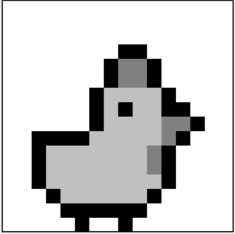
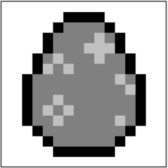

# Poule.gb  
A small Game Boy game about a poule, made with **GBDK** and love.  
The gameplay is simple: you are a poule and you need to eat œufs.  
How many œufs do you have to eat? **Random**.  
Where do they appear? **Random**.  
Oh, and also… good lucky luck to you!

<div align="center">
  


</div>

---

## 🎮 Playing
You can play the game directly in your browser on the Poule.gb itch.io page:  
👉 https://yougo07.itch.io/poulegb

Or you can download the latest version of the game from the releases page:  
👉 https://github.com/Yougo-rgb/Poule.gb/releases

---

## 🚀 Installation and compilation (Windows)

### 1. Install GBDK  
Download the latest version of **GBDK-2020** here:  
👉 https://github.com/gbdk-2020/gbdk-2020  

> **Note:** This project currently uses **GBDK 4.4.0**.  
> https://github.com/gbdk-2020/gbdk-2020/releases/tag/4.4.0

### 2. Place the GBDK folder  
Move the extracted **gbdk** folder to: `C:\`


This allows you to compile the project without modifying `make.bat`.

### 3. Compile the project  
Open a terminal in the project folder and run:

```bash
.\make.bat
```

If everything worked correctly, the compiled ROM will appear in the `/build` folder.

### 4. Play

Open the generated `poule.gb` file with any Game Boy emulator.

## About the project
Poule.gb is actually my first game project ever! (And also the first featuring poule...)

## 👤 Author
- [Pozzi Hugo](https://github.com/Yougo-rgb)

## 🐔 Special thanks to the initial creator of poule.py
- [StroyII](https://github.com/StroyII)

## Egg

### 1. Egg
<div align="center">
  


**_eggcellent_**

</div>

